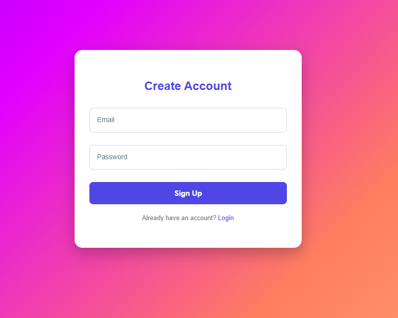
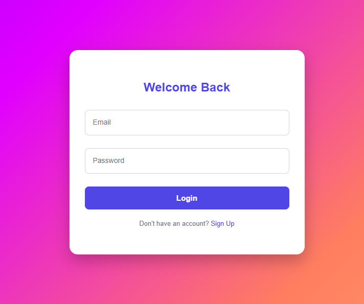
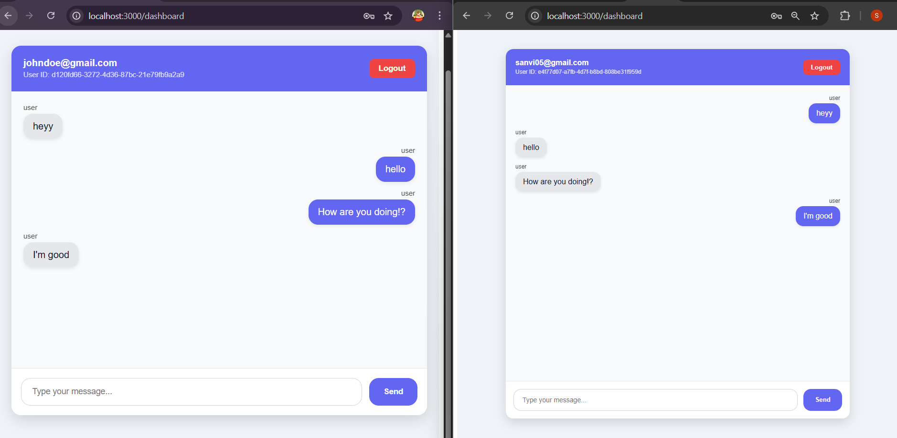
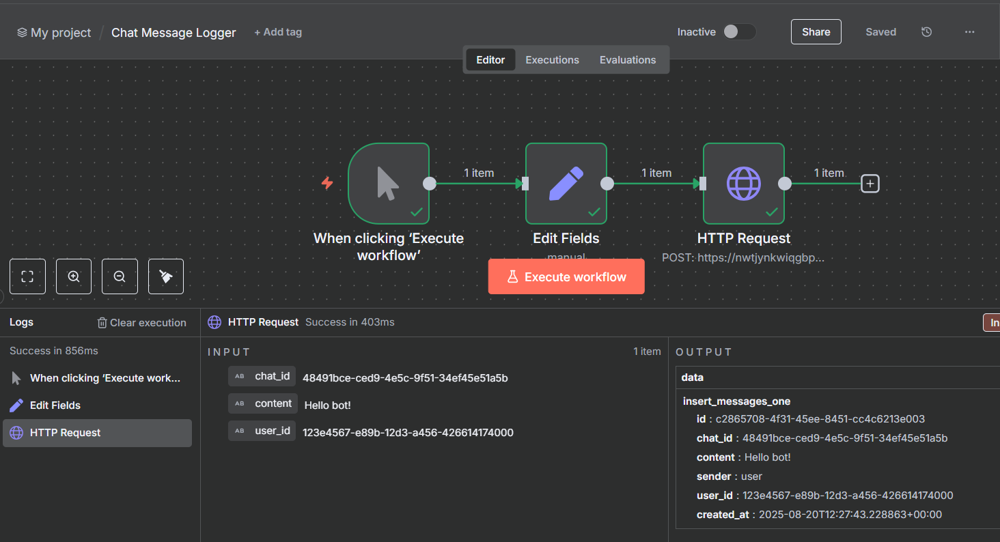

Brave Chatbot 💬⚡

An interactive real-time chat application built with React, Nhost (Auth + Backend), GraphQL (Apollo Client), and n8n automation.
Supports multiple users chatting live with subscriptions, JWT-based authentication, and easy deployment.

## 🚀 Live Demo  
👉 [Try it here!](https://brave-chatbot.netlify.app)

🚀 Features

🔐 User Authentication (Sign up, Login, Logout) via Nhost

💬 Real-time Chat using GraphQL subscriptions

🎨 Modern UI (WhatsApp-like clean interface)

⚡ n8n Workflows to automate notifications / backend tasks

☁️ Ready for Deployment on Netlify

📂 Project Structure
```
brave-chatbot/
├── public/              # Static files
├── src/
│   ├── pages/           # React pages (Login, Signup, Dashboard)
│   ├── graphql/         # Queries, mutations, subscriptions
│   ├── nhost.js         # Nhost + Apollo setup
│   └── App.js           # Routes and auth wrapper
├── workflows/           # n8n workflow JSONs + screenshots
└── README.md
```
⚙️ Tech Stack

Frontend: React, Apollo Client, Tailwind (optional styling)

Backend & Auth: Nhost
 (Hasura + Auth)

Subscriptions: GraphQL over WebSockets

Automation: n8n
 for workflow automation

Hosting: Netlify (Frontend), Nhost (Backend)

🔧 Setup & Run Locally

Clone this repo
```
git clone https://github.com/ShamithaJain/Brave-chatbot.git
cd Brave-chatbot
```

Install dependencies
```
npm install
```
Configure Nhost

Update src/nhost.js with your Nhost subdomain & region.

Ensure your Hasura GraphQL endpoint matches.

Run the app
```
npm start
```
📸 n8n Workflows

This repo also contains workflows/chatbot-flow.json and screenshots of n8n flows that power automation (e.g. notifications, logging).
You can import the JSON into your n8n instance to replicate the setup.

🌍 Deployment

Push your repo to GitHub

Connect GitHub repo to Netlify

Deploy in one click 🚀

## 📸 Screenshots

### 🔑 Signup Page


### 🔑 Login Page


### 💬 Live Chat (Dashboard)


### 🔗 GraphQL Subscriptions


### ⚡ n8n Workflow



🙌 Author

Shamitha Jain
Frontend + Backend Developer • Exploring AI, GraphQL, and workflow automation
